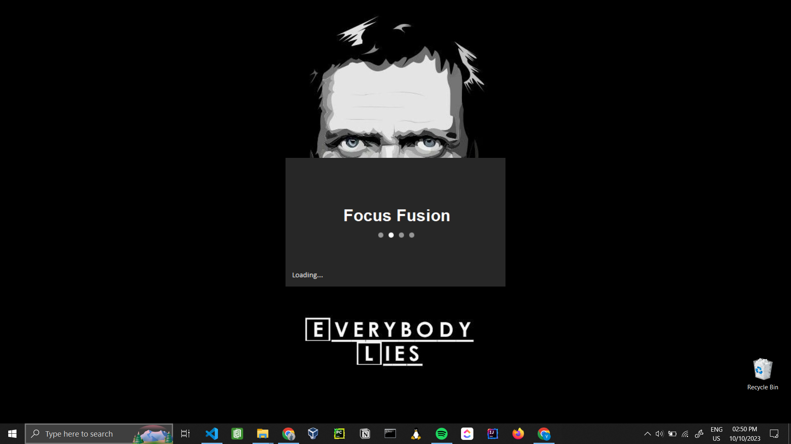
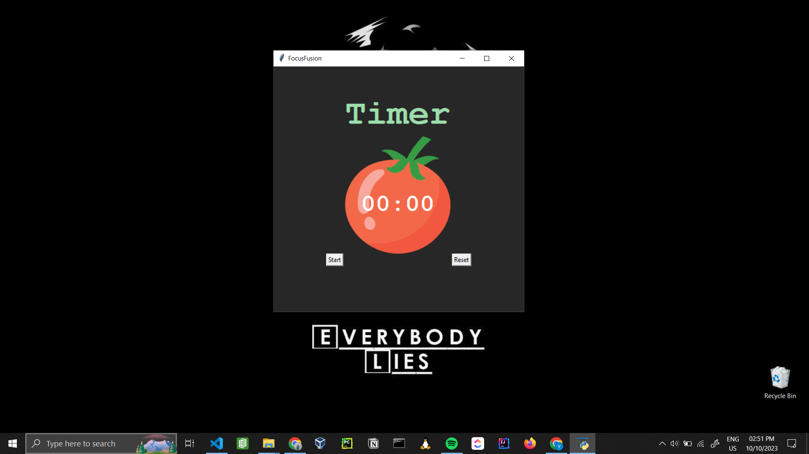

# Focused Fusion Pomodoro Timer

This Python program, Focused Fusion, is a Pomodoro Timer created as an assignment for the 100 Days of Python course instructed by Dr. Angela.

## Features

- The program uses the `tkinter` library for creating the graphical user interface.
- It includes a timer mechanism for tracking work and break sessions.
- The timer follows the Pomodoro Technique, with work sessions of 25 minutes, short breaks of 5 minutes, and long breaks of 20 minutes.
- The program plays a sound when a work or break session ends.
- The timer keeps track of completed work sessions and displays check marks for each completed session.

## Installation

1. Clone the repository or download the source code.
2. Make sure you have Python installed on your system.
3. Install the required libraries by running the following command:
    `pip install tkinter pillow`
4. Run the program by executing the following command:
     `python main.py`

## Usage

1. Upon running the program, a new window will open with the timer interface.
2. Click the "Start" button to start a work session.
3. The timer will count down the remaining time for the work session.
4. When the work session ends, a sound will play, and the timer will switch to a break session.
5. After completing a break session, the timer will switch back to a work session.
6. The program keeps track of completed work sessions and displays check marks for each completed session.
7. Click the "Reset" button to reset the timer and start a new session.

## Screenshots

## Credits

- This program was created as an assignment for the 100 Days of Python course instructed by Dr. Angela.
- The program uses the `tkinter` library for creating the graphical user interface.
- The program uses the `PIL` library for image processing.
- The program uses the `winsound` library for playing sounds.

## License

This project is licensed under the MIT License - see the [LICENSE](LICENSE) file for details.

